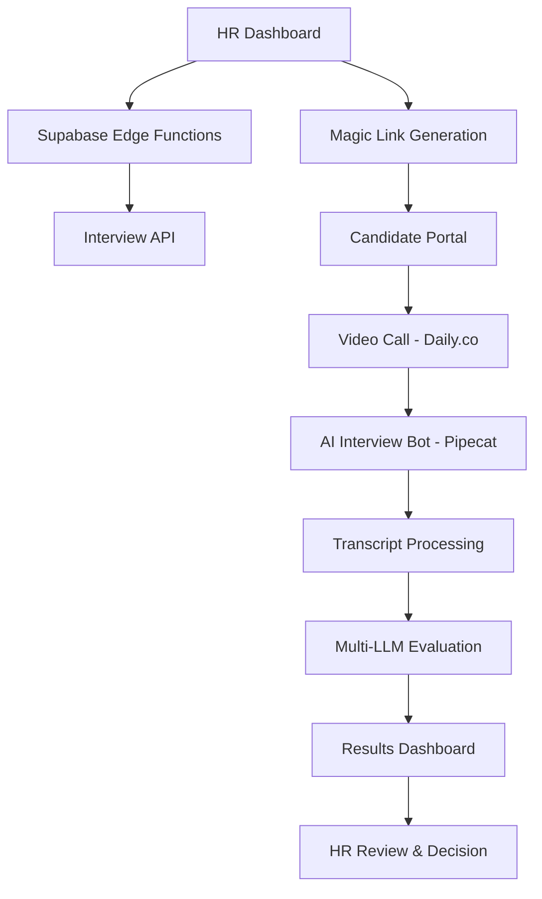

# Minimalagent - AI-Powered HR Interview Platform

An end-to-end AI-powered interview platform that automates the entire recruitment process from scheduling to evaluation. Features conversational AI interviewers, multi-LLM evaluation, and comprehensive HR dashboards.

## 🏗️ Architecture Overview

### Core Components

- **Frontend**: React 18 + Vite SPA with HR dashboards and candidate portals
- **Backend**: FastAPI server handling interview orchestration and API endpoints
- **Database**: Supabase PostgreSQL with real-time capabilities
- **AI Services**: Pipecat conversational bots, Google Cloud Speech, multiple LLM evaluators
- **Video**: Daily.co WebRTC for real-time video interviews
- **Infrastructure**: Docker containerization with Redis caching

### Data Flow Architecture



## 🚀 Quick Start

### Prerequisites

- Python 3.12+
- Node.js 18+
- Docker & Docker Compose
- Supabase account
- API keys for AI services (Google Cloud, OpenAI, etc.)

### Environment Setup

1. **Clone the repository**

   ```bash
   git clone https://github.com/Sleippnir/Minimalagent.git
   cd Minimalagent
   ```

2. **Backend Setup**

   ```bash
   # Install Python dependencies
   pip install -r requirements.txt

   # Copy environment template and configure
   cp .env.example .env
   # Edit .env with your API keys and Supabase credentials
   ```

3. **Frontend Setup**

   ```bash
   cd frontend
   npm install

   # Create environment file
   cp .env.example .env.local
   # Add your Supabase credentials to .env.local
   ```

4. **Database Setup**

   ```bash
   # Run database migrations (via Supabase dashboard or CLI)
   # Import the schema from docs/guidelines/supabase tables.md
   ```

### Running the Application

1. **Start with Docker (Recommended)**

   ```bash
   docker-compose up -d
   ```

   This starts all core services:
   - `api`: FastAPI server on port 8001
   - `background-evaluator`: Continuous evaluation processing
   - `frontend`: Nginx serving React app on port 8080

   For maintenance operations:

   ```bash
   docker-compose --profile maintenance up -d
   ```

2. **Manual Startup**

   ```bash
   # Terminal 1: Start backend API
   python -m uvicorn interview_api:app --host 0.0.0.0 --port 8001

   # Terminal 2: Start frontend
   cd frontend && npm run dev

   # Terminal 3: Start background evaluator
   python background_evaluator.py

   # Optional: Start content maintenance (run periodically)
   python scripts/maintain_content.py
   ```

3. **Access the application**
   - HR Dashboard: `http://localhost:5173` (frontend dev server)
   - API Documentation: `http://localhost:8001/docs`
   - Health Check: `http://localhost:8001/health`

## 📋 API Endpoints

### Core Interview Management

#### `GET /health`

Health check endpoint.

```json
{
  "status": "healthy",
  "service": "interview-api"
}
```

#### `GET /interviews/{jwt_token}`

Retrieve interview context for candidates.

- **Purpose**: Get complete interview payload using JWT token
- **Response**: Interview data including candidate, job, questions, and AI prompts

#### `POST /interviews/{interview_id}/transcript`

Submit completed interview transcript.

- **Body**:

```json
{
  "turns": [
    {"speaker": "Interviewer", "text": "Tell me about yourself"},
    {"speaker": "Candidate", "text": "I'm a software engineer..."}
  ]
}
```

### Administrative Endpoints

#### `GET /admin/bot-processes`

Monitor active bot processes.

- **Response**: List of running interview bots with PIDs and runtime

#### `POST /admin/cleanup/{interview_id}`

Manually terminate bot processes.

### Content Management (Admin)

#### `POST /admin/content/validate-job-tags`

Generate semantic tags for job descriptions.

#### `POST /admin/content/validate-question-tags`

Generate semantic tags for interview questions.

#### `POST /admin/content/fix-job/{job_id}`

Update tags for existing jobs.

#### `POST /admin/content/fix-question/{question_id}`

Update tags for existing questions.

#### `GET /admin/content/audit`

Audit content consistency across jobs and questions.

#### `POST /admin/content/bulk-fix`

Fix all content consistency issues.

#### `POST /admin/content/refresh-relationships/{job_id}`

Refresh question-job relationships based on tags.

## 🔧 Supabase Edge Functions

### `schedule-interview`

**Purpose**: Create and schedule new interviews

**Input**:

```json
{
  "application_id": "uuid",
  "question_ids": ["uuid1", "uuid2"],
  "resume_path": "resumes/file.pdf",
  "interviewer_prompt_version_id": "uuid",
  "evaluator_prompt_version_id": "uuid"
}
```

**Process**:

1. Downloads and processes resume from Supabase Storage
2. Fetches prompts and rubric versions
3. Creates interview record in `interviews` table
4. Generates interview script in `interview_questions`
5. Queues payload in `interviewer_queue`
6. Triggers email notification

### `send-login-links`

**Purpose**: Send magic link emails to candidates

**Process**:

1. Generates Supabase Auth magic links
2. Sends HTML emails with secure login URLs
3. Updates notification status

## 🗄️ Database Schema

### Core Entities

- **`candidates`**: Candidate profiles and contact information
- **`jobs`**: Job descriptions with semantic tags
- **`questions`**: Interview question bank with categories
- **`applications`**: Candidate-job application links

### Version Control

- **`prompts`** & **`prompt_versions`**: Versioned AI prompts for interviewers/evaluators
- **`rubrics`** & **`rubric_versions`**: Structured evaluation criteria

### Workflow Tables

- **`interviews`**: Central interview orchestration
- **`interview_questions`**: Ordered question scripts
- **`interviewer_queue`**: Active interview payloads
- **`evaluator_queue`**: Completed interviews awaiting evaluation

### Results & Analytics

- **`transcripts`**: Raw conversation data
- **`evaluations`**: Multi-LLM assessment results

## 🤖 AI Components

### Interview Bot (Pipecat)

- **Framework**: Pipecat AI for conversational interfaces
- **Speech**: Google Cloud Speech-to-Text, Text-to-Speech
- **Context**: Dynamic conversation management with memory
- **Tools**: Context cleaning, conversation termination

### Multi-LLM Evaluation

- **OpenAI GPT-4o**: Primary technical/behavioral assessment
- **Google Gemini-2.5-flash**: Alternative evaluation perspective
- **DeepSeek (OpenRouter)**: Additional validation
- **Rubric-Based**: Structured scoring against predefined criteria

### Background Processing

- **Agent**: `BackgroundEvaluatorAgent` polls `evaluator_queue`
- **Trigger**: Automatic evaluation after transcript submission
- **Storage**: Results stored with full LLM response metadata

## 🎯 Key Features

### For HR Teams

- **Interview Scheduling**: Drag-and-drop question selection, resume upload
- **Real-time Monitoring**: Live bot process tracking, interview status
- **Multi-perspective Evaluation**: 3 LLM evaluations per interview
- **Content Management**: Automated tagging and relationship management

### For Candidates

- **Seamless Experience**: Magic link login, no account creation
- **Natural Conversation**: AI interviewer adapts to responses
- **Video Interface**: Professional video call experience

### For Developers

- **Extensible Architecture**: Modular design for custom integrations
- **Comprehensive APIs**: RESTful endpoints for all operations
- **Real-time Updates**: Supabase real-time subscriptions
- **Containerized**: Docker deployment with environment isolation

## 🔒 Security & Privacy

- **JWT Authentication**: Single-use tokens for candidate access
- **Supabase Auth**: Secure user management and magic links
- **Data Encryption**: All sensitive data encrypted at rest
- **Access Control**: Role-based permissions (HR, Candidate, Admin)

## ⚙️ Background Processes & Maintenance

### Core Background Services

#### 1. Background Evaluator (`background_evaluator.py`)

- **Purpose**: Processes completed interviews with AI evaluation
- **Trigger**: Runs continuously, polls `evaluator_queue` every 30 seconds
- **Function**: Multi-LLM evaluation (OpenAI GPT-4o, Google Gemini, DeepSeek)
- **Output**: Structured evaluation results stored in database

#### 2. Interview Bot Processes

- **Purpose**: Handle real-time AI-powered interviews
- **Trigger**: Launched automatically when candidates access interview URLs
- **Function**: Pipecat-based conversational AI with speech processing
- **Management**: Monitored via `/admin/bot-processes` endpoint

### Maintenance Scripts (Run Periodically)

#### 3. Content Maintenance (`scripts/maintain_content.py`)

- **Purpose**: Ensures tag consistency between jobs and questions
- **Frequency**: Run daily or after bulk content updates
- **Function**: Audits and fixes content relationships using `AutomatedTagger`

#### 4. Content Manager Operations

- **Purpose**: Bulk operations for content consistency
- **Available Operations**:
  - Tag validation for new content
  - Bulk fixing of existing content issues
  - Relationship optimization between jobs and questions
  - Comprehensive content auditing

### Recommended Cron Jobs

```bash
# Daily content maintenance (run at 2 AM)
0 2 * * * /path/to/minimalagent/scripts/maintain_content.py

# Weekly comprehensive audit (run Sundays at 3 AM)
0 3 * * 0 /path/to/minimalagent/scripts/content_manager.py audit
```

## 📊 Monitoring & Analytics

- **Health Checks**: Automated service monitoring
- **Bot Process Tracking**: Real-time bot status and cleanup
- **Content Auditing**: Automated consistency validation
- **Performance Metrics**: Interview completion rates, evaluation scores

## 🚀 Deployment

### Production Setup

1. **Supabase**: Deploy edge functions and configure database
2. **Docker Services**: Deploy all containers with proper orchestration
   - `api`: Main application server
   - `background-evaluator`: Continuous evaluation processing
   - `content-maintenance`: Scheduled content maintenance (optional)
   - `frontend`: Static file serving
3. **Environment**: Configure production API keys and secrets
4. **Domain**: Set up custom domain with SSL
5. **Monitoring**: Configure logging and alerting

### Scaling Considerations

- **API Service**: Horizontal scaling with multiple instances behind load balancer
- **Background Evaluator**: Can run multiple instances for parallel processing
- **Content Maintenance**: Run on schedule or as needed, not continuously
- **Database**: Supabase handles scaling automatically
- **AI Services**: Rate limiting and cost optimization across all LLM providers
- **Storage**: CDN for resume files and transcripts

## 🤝 Contributing

1. Fork the repository
2. Create a feature branch
3. Make your changes
4. Add tests for new functionality
5. Submit a pull request

## 📝 License

This project is licensed under the MIT License - see the LICENSE file for details.

## 🆘 Support

- **Documentation**: Check the `docs/` directory for detailed guides
- **Issues**: Report bugs and request features on GitHub
- **Discussions**: Join community discussions for questions

---

**Built with**: FastAPI, React, Supabase, Pipecat AI, Daily.co, Docker
